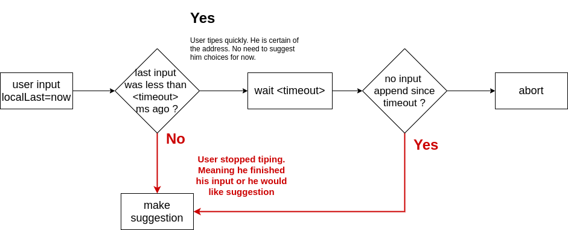

# Vuetify Google components

> Defines a set of reusable components designed using vuetify, that has built in interactions with Google's APIs.

## Table of contents

- [Vuetify Google components](#vuetify-google-components)
  - [Table of contents](#table-of-contents)
  - [How to use ?](#how-to-use-)
    - [Requirements](#requirements)
    - [Installation](#installation)
  - [Library types](#library-types)
    - [Place](#place)
  - [Available components](#available-components)
    - [Autocomplete](#autocomplete)
      - [Example usage](#example-usage)
      - [Lazy loading explained](#lazy-loading-explained)
    - [Map](#map)
      - [Example usage](#example-usage-1)

## How to use ?

### Requirements

In order to use this library, you have to properly configure the following
- vuetify (used to style components)


### Installation

Register `VuetifyGoogleComponents` in your `vue.js` application.

```typescript
import Vue from 'vue'
import VuetifyGoogleComponents from './path/to/vuetify-google-components'

Vue.use(VuetifyGoogleComponents, {
  apiKey: process.env.VUE_APP_GOOGLE_API_KEY
})

```

> Here I assume you provided an environment variable named `VUE_APP_GOOGLE_API_KEY` containing a valid api key [provided by google](https://developers.google.com/maps/documentation/javascript/get-api-key)

## Library types

### Place
```typescript
{
  name: string;
  location: {
    lat: number;
    lng: number;
  }
}
```

## Available components

### Autocomplete

Input to query addresses from Google Places.
When an option is selected, `v-model` is updated with the selected [Place](#place).

#### Example usage

```html
<template>
  <google-place-autocomplete v-model="place" />
</template>
```

#### Lazy loading explained

To optimize your google API key's quotas, you don't want to call google search api each time the query changes. That's why autocomplete suggestions are lazy loaded according to the following principle.



### Map

Display a [Place](#place) object in a Google map.

Optionally centered on another [Place](#place).

#### Example usage

Assuming you want to search places next to Bejing, you could do the following.

```html
<template>
  <google-place-autocomplete v-model="place" />
  <google-map :place="place" :center="bejing"/>
</template>

<script>
export default{
  data(){
    return {
      place: null,

      bejing: {
        name: 'Bejing',
        location: {
          lat: 39.90419989,
          lng: 116.4073963
        }
      }
    }
  }
}
</script>
```